# Antigravity 實戰開發與協作教學手冊

本手冊由 **指導老師** 親自指導，記錄專案開發的協作規範以及 Antigravity 的基礎使用教學，供學生學習與實作參考。

> **版權聲明**：© 2026 **Falo x Force Cheng** (發布於 2026/6/8)。本手冊版本為 **Ver 1.01**。
> 本內容僅供**教學用途**使用，如有任何商業用途需求，請務必聯繫作者取得授權。


---

## 目錄
1. [下載與安裝 Antigravity](#1-下載與安裝-antigravity-download--install)
* **[✦ 補充1. 安裝與設定 Python 開發環境](#補充1-安裝與設定-python-開發環境-python-environment-setup)**
2. [Antigravity 主介面功能導覽](#2-antigravity-主介面功能導覽)
3. [如何在 Antigravity 中建立專案與載入資料夾](#3-如何在-antigravity-中建立專案與載入資料夾)
* **[✦ 補充2. 實戰演練一：使用單一提示詞自動化將 PDF 題庫轉換為 CSV 檔案](#補充2-實戰演練一-使用單一提示詞自動化將-pdf-題庫轉換為-csv-檔案-pdf-to-csv-conversion-practice)**
* **[✦ 補充3. 實戰演練二：題庫內容比對與 HTML 驗證報告生成](#補充3-實戰演練二-題庫內容比對與-html-驗證報告生成-pdf--csv-verification-practice)**
4. [設定與安全權限管理](#4-設定與安全權限管理-settings--security-permissions)
5. [外觀與對話顯示設定](#5-外觀與對話顯示設定-appearance--chat-display-settings)
6. [AI 模型與配額管理](#6-ai-模型與配額管理-ai-models--quotas)
7. [自訂指令與外掛技能管理](#7-自訂指令與外掛技能管理-customizations--skills)
8. [瀏覽器自動化設定](#8-瀏覽器自動化設定-browser-settings)
9. [應用程式基礎設定](#9-應用程式基礎設定-app-settings)
10. [實戰演練 - 建立與管理第一個自訂 Skill](#10-實戰演練---建立與管理第一個自訂-skill)
11. [專案專屬偏好與本地安全權限設定](#11-專案專屬偏好與本地安全權限設定-project-specific-settings)
12. [實戰進階 - 建立 GitHub Connector 技能](#12-實戰進階---建立-github-connector-技能)
13. [附錄：協作規範與原則](#附錄協作規範與原則)
---

## 1. 下載與安裝 Antigravity (Download & Install)

本章將引導學生下載與安裝 Antigravity 2.0 軟體，以進行後續的 AI 協作開發與實作。

### 1.1 進入官網首頁
請使用瀏覽器開啟 Antigravity 官方網站：[https://antigravity.google/](https://antigravity.google/)。

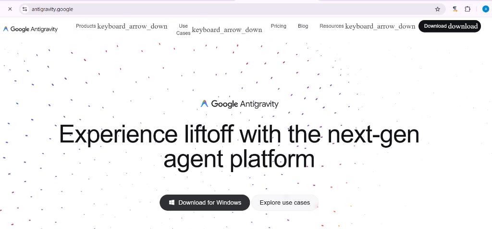

在首頁中央，點選 **`Download for Windows`** 按鈕（若使用其他作業系統，亦可點選右上角的 **`Download`**），即可導覽至下載頁面。

### 1.2 選擇對應的作業系統下載
官方下載頁面網址為：[https://antigravity.google/download](https://antigravity.google/download)。

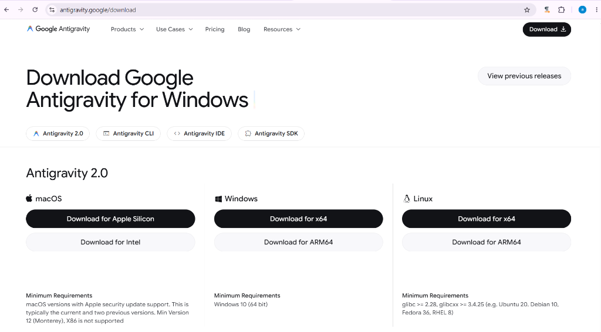

請依據您當前電腦的作業系統與硬體架構，選擇對應版本進行下載：
* **macOS**：
  * **`Download for Apple Silicon`**：適用於 Apple M1/M2/M3 等晶片（目前主流晶片）。
  * **`Download for Intel`**：適用於較早期的 Intel 處理器 Mac 電腦。
* **Windows**：
  * **`Download for x64`**：適用於一般常見的 64 位元 Intel 或 AMD 處理器 Windows 電腦。
  * **`Download for ARM64`**：適用於採用 ARM 架構處理器的新型 Windows 電腦。
* **Linux**：
  * **`Download for x64`**
  * **`Download for ARM64`**

下載完成後，雙擊安裝檔並依據畫面提示完成安裝即可啟動 Antigravity 主介面。

---

## 補充1：安裝與設定 Python 開發環境 (Python Environment Setup)

在我們開始使用 Antigravity 進行 AI 協作開發與小程式撰寫前，必須先建立好本地的 Python 執行環境。

### 補充1.1 為什麼需要安裝 Python 基本環境？
* **宿主命令支援**：Windows 預設不提供 `python` 命令。我們需要安裝 Python，讓作業系統核心認識 `python` 與 `pip` 指令。
* **腳本與工具基石**：後續實作（如把 IPAS 題庫 PDF 解析並轉換為 CSV 檔案）需要透過 Python 腳本來執行。
* **AI 助理自動化執行**：Antigravity 在背景為您分析程式碼、安裝相依套件、甚至執行測試時，都需要依賴您本機安裝的 Python 作為引擎。

### 補充1.2 認識全域變數（PATH 環境變數）
全域環境變數（常簡稱為 `PATH`）是作業系統中一個極為重要的設定。
* **工作原理**：當我們在終端機（Terminal）輸入一個指令（如 `python` 或 `pip`）時，系統會自動到 `PATH` 變數所記錄的所有資料夾路徑中，依序尋找是否有對應的執行檔（如 `python.exe`）。
* **重要性**：如果沒有將 Python 安裝目錄加入全域變數 `PATH` 中，當您在任何目錄下輸入 `python` 時，系統將會回傳「無法識別此命令」的錯誤，迫使您每次都必須輸入極長的絕對路徑（如 `C:\Users\...\AppData\Local\Programs\Python\Python312\python.exe`），這在人機協作與自動化開發中會造成極大的障礙。

---

### 補充1.3 安裝方法一：使用 Agent 自動安裝（推薦使用）
如果您使用的是 Antigravity 2.0 系統，且您的 Windows 已啟用終端機安全許可，您可以**直接指示 AI 助理為您自動安裝與設定**。

* **步驟**：
  直接在與 Antigravity 助理的對話框中輸入指令：
  > *「請幫我安裝最新穩定版 Python 並設定全域環境變數。」*
* **AI 背景處理機制**：
  AI 助理會自動在您的系統終端機呼叫 Windows 官方套件管理器 `winget` 執行靜默安裝：
  ```powershell
  winget install Python.Python.3.12 --silent --accept-package-agreements
  ```
  `winget` 在安裝過程中會**自動完成所有全域環境變數（PATH）的設定**，學生完全不需要進行手動配置，非常方便。

---

### 補充1.4 安裝方法二：標準手動安裝（描述）
如果您需要手動在 Windows 上部署 Python，可依循下列標準安裝步驟：

1. **下載安裝檔**：前往 Python 官方網站 [https://www.python.org/downloads/](https://www.python.org/downloads/)，下載適用於 Windows 的 `Windows installer (64-bit)` 安裝程式。
2. **啟動安裝程式**：雙擊執行下載的安裝檔。
3. **【極為重要】勾選 PATH 變數**：在安裝程式啟動的首頁，**務必勾選底部的「Add python.exe to PATH」複選框**。
4. **開始安裝**：點擊大大的 **`Install Now`** 按鈕，靜待安裝程式自動複製檔案完成。
5. **解除路徑限制**：若安裝結束時出現 `Disable path length limit` 的選項，可點擊放行。

---

### 補充1.5 專案獨立執行環境的考量（全域 vs 虛擬環境 .venv）
當我們安裝完 Python 基本環境（即「全域環境」）後，未來在開發多個不同的專案時，需要評估是否要為各專案建立專屬的「虛擬環境（Virtual Environment, `.venv`）」：

| 比較維度 | 全域環境 (Global Environment) | 專案虛擬環境 (Virtual Environment / .venv) |
| :---: | :--- | :--- |
| **定義** | 系統中唯一的 Python 主環境，套件裝在公共資料夾中。 | 位於專案目錄下的獨立資料夾，環境與套件完全隔離。 |
| **建立方式** | 無需手動建立，系統預設路徑。 | 於專案根目錄下執行：`python -m venv .venv` |
| **優點** | 簡單直覺，新手不需切換環境，隨開隨用。 | 防止套件衝突。專案 A 使用 v1，專案 B 使用 v2 互不干涉。 |
| **缺點** | 裝太多套件後容易混亂或因版本覆蓋導致程式壞掉。 | 每個專案資料夾會佔用額外的磁碟空間（約數十至數百 MB）。 |
| **推薦場景** | **簡單學習、單一腳本實作（如本手冊之 IPAS 題庫轉換）**。 | **中大型專案、商業系統開發、團隊協作專案**。 |

> [!TIP]
> **Antigravity 與虛擬環境的對接**：
> 當您使用 Antigravity 開啟專案時，系統會自動在您的根目錄掃描是否存在 `.venv` 資料夾，若存在，AI 在執行或排程任何工具腳本時，會**優先叫用該虛擬環境中的 python 核心**，確保與您專案的依賴版本完全一致。

---

### 補充1.6 驗證環境安裝
不論使用方法一或方法二完成安裝後，請在您的命令列（PowerShell 或 Command Prompt）輸入以下指令驗證：

* **驗證 Python 是否成功安裝**：
  ```powershell
  python --version
  ```
  *(預期輸出如：`Python 3.12.x`)*
  
* **驗證套件管理器 pip 是否可用**：
  ```powershell
  pip --version
  ```
  *(預期輸出如：`pip 24.x.x from ... (python 3.12)`)*

---

## 2. Antigravity 主介面功能介紹

以下是 Antigravity 的主畫面功能分佈說明：

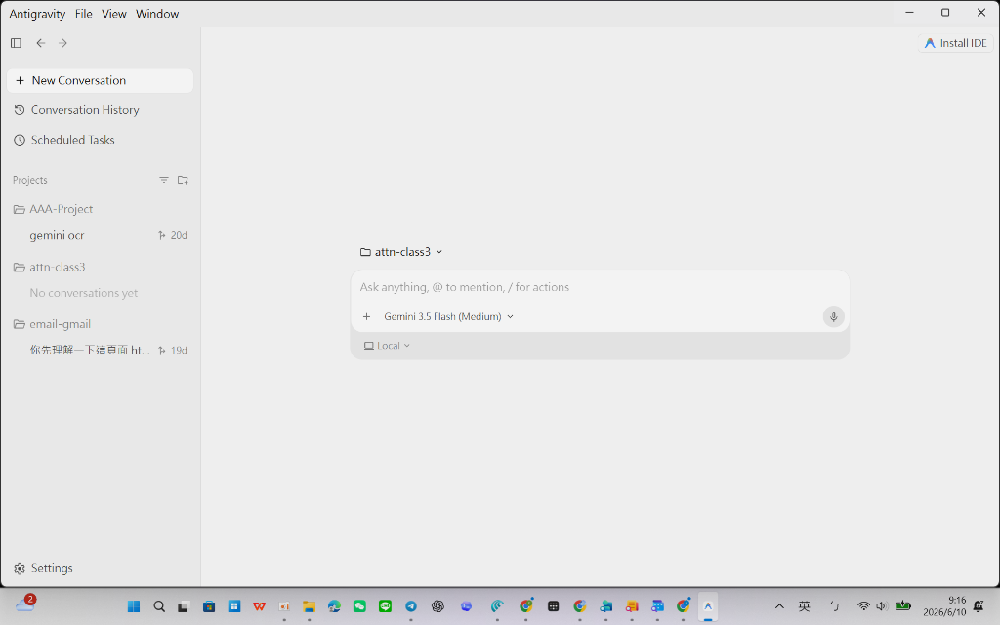

### 2.1 頂部選單欄 (Top Menu Bar) 詳細說明

頂部選單欄包含四個下拉選單，分別控制系統資訊、檔案與對話、介面縮放以及視窗狀態：

#### A. Antigravity 選單
* **Version 2.0.11**：顯示目前的軟體版本。
* **Check for Updates**：連線檢查是否有最新的版本可供更新。

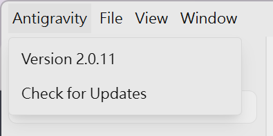

#### B. File 選單
* **New Conversation** (快捷鍵 `Ctrl + N`)：建立一個全新的 AI 協作對話。
* **Create Project**：建立新專案並載入本地資料夾。
* **Command Palette** (快捷鍵 `Ctrl + Shift + P`)：開啟全域指令面板，可快速搜尋並執行系統功能。

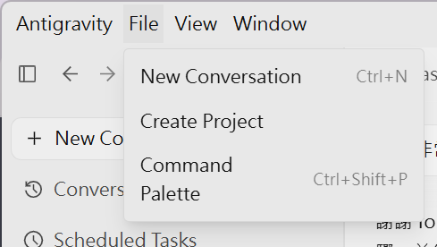

#### C. View 選單
* **Zoom In / Zoom Out / Reset Zoom**：縮放軟體介面的字體與面板大小。
* **Toggle Developer Tools**：切換開發者工具。在軟體卡頓或功能異常時，可用於開啟偵錯主控台 (Console) 查看系統錯誤日誌。

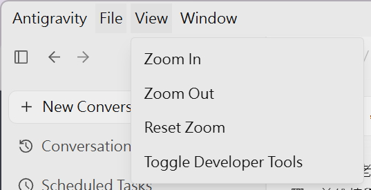

#### D. Window 選單
* **Minimize**：最小化軟體視窗。
* **Maximize**：最大化或還原軟體視窗。
* **Close**：關閉目前軟體視窗。

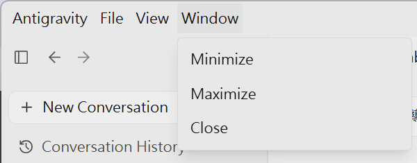


### 2.2 左側導覽邊欄 (Left Sidebar)
* **`+ New Conversation`**：開啟一個全新的 AI 協作對話。
* **`Conversation History`**：檢視過去的所有對話紀錄。
* **`Scheduled Tasks`**：檢視目前背景執行或定時觸發的任務。
* **`Projects`**：列出目前掛載的專案目錄（如當前選中的 `attn-class3`）。
* **`Settings` (齒輪)**：調整 API Key、外掛套件與偏好設定。

### 2.3 中央主工作對話區 (Main Workspace Panel)
* **專案指示器**：頂部顯示目前關聯的專案名稱。
* **對話輸入框**：輸入指令。可輸入 `@` 標記檔案，或輸入 `/` 使用快捷工作流。
* **模型選擇器**：切換使用的 AI 模型（例如：`Gemini 3.5 Flash (Medium)`）。
* **執行環境**：顯示或選擇程式執行的環境（如 `Local`）。
* **`+` 與 麥克風**：附加上傳資料與語音輸入的快捷按鈕。

### 2.4 右上角動作按鈕
* **`Install IDE`**：下載並安裝編輯器（VS Code、Cursor）的整合套件，實現 AI 代碼即時同步。

---

## 3. 如何在 Antigravity 中建立專案與載入資料夾

以下為逐步建立專案並載入本地資料夾的引導：

### 步驟 1：啟動建立選單
請將滑鼠移至左側邊欄的 **`Projects`** 列表，點擊右邊對應的 **`+`** 資料夾圖示。隨後在彈出的快捷選單中點選 **`New Project`** (建立專案)。

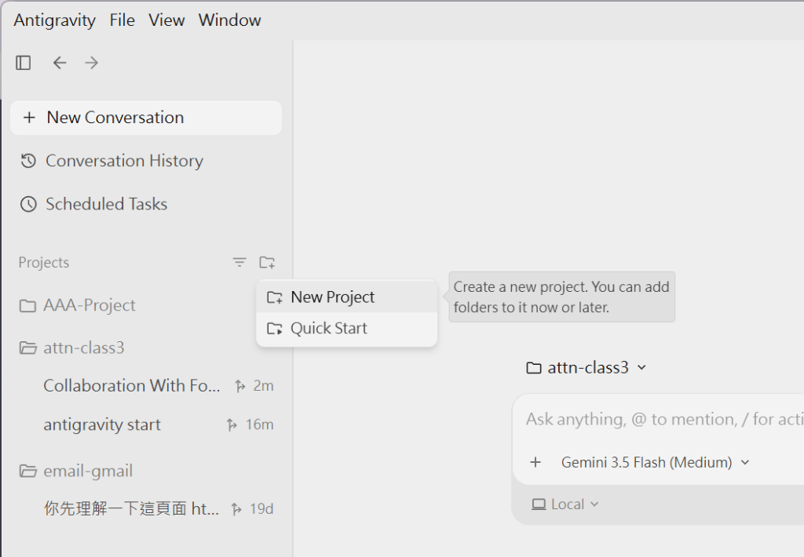

### 步驟 2：點擊新增資料夾按鈕
彈出專案建立對話框後，點選中央的 **`+ Add Folder`** (新增資料夾)。

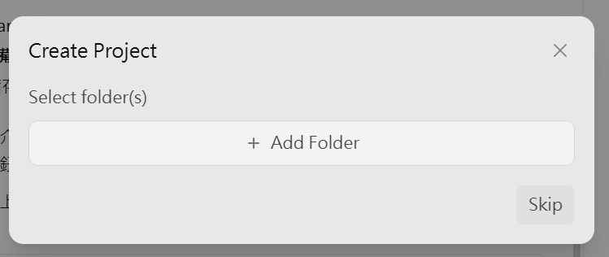

### 步驟 3：選擇本地專案路徑
在系統彈出的檔案總管中，導覽至您的專案目錄（例如 `D:\AAA-Project\attn-class3`），選取後點選右下角的 **「選擇資料夾」** 完成掛載。

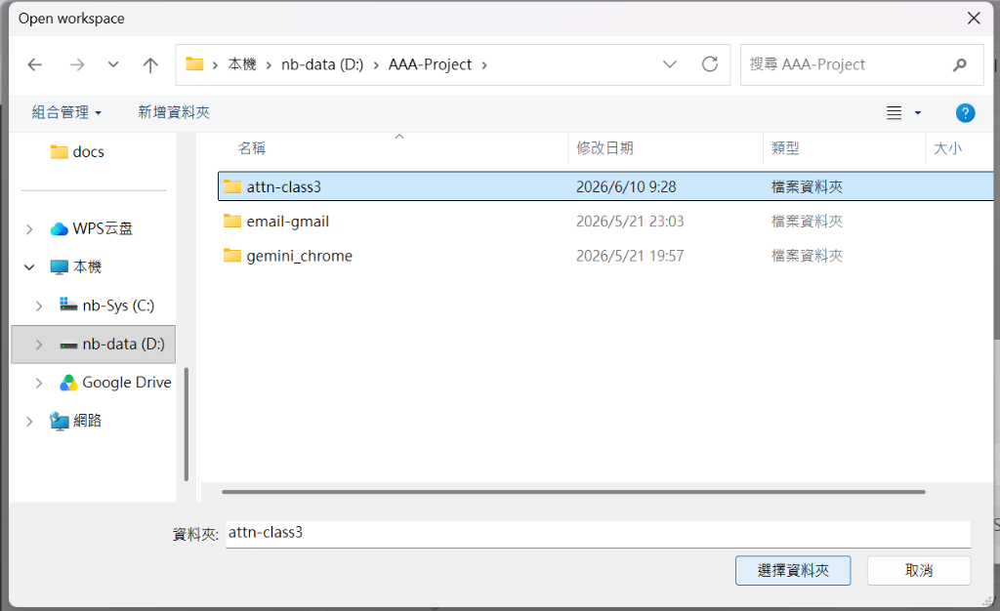

## 補充2：實戰演練一 —— 使用單一提示詞自動化將 PDF 題庫轉換為 CSV 檔案 (PDF to CSV Conversion Practice)

在本章節中，我們將進行第一個實戰演練：將 IPAS 官方 PDF 題庫直接轉換為結構化的 CSV 題庫檔案，為後續建立題庫系統做好資料準備。

這項任務的特色在於**「AI 代理人機協作」**：學員**不需要**手動安裝複雜的解析套件或撰寫 Python 程式碼。如果過程中缺少套件或遇到問題，可以直接在對話中對 Antigravity 發送指令，讓 AI 助理自動執行指令安裝與排除錯誤。

---

### 補充2.1 實戰版本一：直接分析網址 (網址轉檔版 - 推薦)
學員可以直接提供 AI 官方題庫的 PDF 網址，下達極簡的提示詞，由 AI 助理直接在網路抓取並下載解析：

> **提示詞輸入範例：**
> 
> 「請幫我讀取這個網址的 PDF：`https://drive.google.com/file/d/1wsP68afcDycEptNa3R44ShObBgaEeFG6/view?usp=sharing`，把裡面的 50 題選擇題整理並存成一個 CSV 題庫。產出的 CSV 檔案請命名為 `ipas_exam.csv`，欄位要包含：`題號`、`答案`、`題目描述`、`選項A`、`選項B`、`選項C`、`選項D`。請注意過濾掉頁首頁尾，並使用 UTF-8 BOM 編碼以防亂碼。」

---

### 補充2.2 實戰版本二：先下載後指定檔名 (本地檔案版)
> 💡 **貼心備註**
> 目前 Antigravity 的對話框尚不支援直接以 `Ctrl+v` 快速鍵複製貼上 PDF 等非圖片格式為對話附件（圖片可直接貼上）。

若因為網路存取受限，或要處理本地已下載的 PDF，可先自行下載該試題 PDF，放入您的專案根目錄中（例如 `D:\AAA-Project\attn-class3`），更名為 `ipas_exam.pdf`，然後在對話中告知 Agent 該檔名進行讀取：

> **提示詞輸入範例：**
> 
> 「我已經下載題庫 PDF 存放在專案目錄中，檔名為 `ipas_exam.pdf`。請幫我讀取它並整理成 CSV 題庫. 產出的 CSV 檔案請命名為 `ipas_exam.csv`，欄位要包含：`題號`、`答案`、`題目描述`、`選項A`、`選項B`、`選項C`、`選項D`。請注意過濾頁首頁尾，並使用 UTF-8 BOM 編碼。」

---

### 補充2.3 遇到問題？直接與 AI 助理互動排錯！
在整個開發執行過程中，如果遇到任何錯誤或不滿意，請直接以對話指令讓 AI 助理自動修復：

* **情境 A：缺少解析套件 (出現 ModuleNotFoundError)**
  * **錯誤現象**：執行 Python 時，提示 `ModuleNotFoundError: No module named 'pypdf'`。
  * **與 AI 互動**：不需手動操作命令列。直接對 AI 說：`「執行時提示找不到 pypdf 套件，請幫我安裝它並重新執行。」`，AI 助理即會自動在背景安裝並再次執行程式碼。
* **情境 B：CSV 檔案用 Excel 開啟時出現中文亂碼**
  * **現象描述**：雙擊 CSV 以 Microsoft Excel 開啟時，中文字元變成亂碼（但用記事本開啟正常）。
  * **與 AI 互動**：直接對 AI 反饋：`「我用 Excel 開啟輸出的 CSV 時出現中文亂碼，請幫我修正為帶有 BOM 的 UTF-8 編碼 (utf-8-sig) 重新存檔。」`
* **情境 C：跨頁處的題目文字被截斷或黏合不全**
  * **現象描述**：因為 PDF 跨頁的分頁標記導致兩頁之間的題目文字拼接出錯。
  * **與 AI 互動**：直接對 AI 指明：`「第 X 題和第 Y 題在跨頁拼接處的文字有重複（或被截斷），請修正程式碼中的段落黏合邏輯，並重新產出 CSV。」`

---

## 補充3：實戰演練二 —— 題庫內容比對與 HTML 驗證報告生成 (PDF & CSV Verification Practice)

在本章節中，我們將進行第二個實戰演練：寫一個 Python 比對程式，自動校對我們在補充 2 中生成的 `ipas_exam.csv` 題庫與原本的 `ipas_exam.pdf`，以確保轉檔內容的正確性，並輸出精美的 HTML 比對報告。

本演練的特色在於提供**雙版本 Prompt** 示範，展現對 AI 助理不同精準度指令所產生的代碼差異，並引導學員如何在遇到比對問題時與 AI 互動除錯。

---

### 補充3.1 執行提示詞（雙版本範例）

#### 💡 版本一：小白版 (Simple Prompt)
非常直覺、只說明輸入輸出，放手讓 AI 自行發揮比對邏輯與報告排版樣式：

> **提示詞輸入範例：**
> 
> 「請幫我比對專案目錄下的 `ipas_exam.pdf` 與 `ipas_exam.csv` 兩份檔案。我希望確認 CSV 轉換後的題號、答案、題目描述和選項是否與 PDF 內容完全一致。請用 Python 寫一個比對程式，執行比對後，產出一個精美的 HTML 檢查報告，命名為 `verification_report.html`，用顏色清楚標示哪些題目比對成功、哪些有差異。」

#### ⚡ 版本二：精確版 (Precise Prompt)
給出清晰的比對規格與防呆規則，並嚴格限制 HTML 的排版風格，一鍵產出具備工業規格的儀表板：

> **提示詞輸入範例：**
> 
> 「請撰寫一個 Python 腳本 `verify_exam.py`，比對目錄下的 `ipas_exam.pdf` 與 `ipas_exam.csv`。
> 
> 規格與比對邏輯如下：
> 1. **資料讀取**：使用 `pypdf` 提取 `ipas_exam.pdf` 文字，並讀取 `ipas_exam.csv`。
> 2. **比對機制**：對於 1 至 50 題，在 PDF 提取出的文字中搜尋該題的題目描述關鍵字（忽略空格與換行）與四個選項，檢查 CSV 欄位文字是否與 PDF 吻合，並驗證 CSV 中標記的「答案」是否與 PDF 公告答案一致。
> 3. **HTML 報告格式**：產出 `verification_report.html`，排版需使用高質感的深色主題與磨砂玻璃風格。報告需包含：
>    * **摘要數據**：總題數 (50)、完全一致題數、異常題數。
>    * **詳細比對清單**：每一題的比對結果卡片。若比對完全一致，卡片邊框為綠色微光；若有差異（例如文字不匹配、選項遺漏或答案錯誤），邊框為紅色微光，並用黃字高亮標示出具體不一致的欄位與文字內容。
>    * 腳本執行完畢後請自動生成此 HTML 檔。」

---

### 補充3.2 遇到問題？直接與 AI 助理互動排錯！
在比對過程中如果遇到誤判或亂碼，同樣不需要緊張，直接在對話中對 AI 發送微調指令：

* **情境 A：比對邏輯太過嚴苛 (因空格、標點符號不一致判定全部失敗)**
  * **現象描述**：由於 PDF 文字提取時常含有不規則的換行與全半形空格，直接字串比對容易造成大量的 False Positives（誤判為不匹配）。
  * **與 AI 互動**：直接對 AI 反饋：`「比對邏輯太嚴格了，請在比對題目描述與選項時，忽略所有空格、標點符號、換行以及全半形中英文字元的差異，只要核心文字語意吻合即可。」`，AI 將會自動修改比對程式，引入更具彈性的字串清理機制。
* **情境 B：產出的 HTML 報告用瀏覽器開啟出現中文亂碼**
  * **現象描述**：生成 HTML 後在瀏覽器開啟，所有中文字全部變成亂碼。
  * **與 AI 互動**：直接對 AI 反饋：`「HTML 驗證報告檔案開啟時中文是亂碼，請在 Python 寫入 HTML 檔案時使用 UTF-8 編碼重新輸出。」`

---

## 4. 設定與安全權限管理 (Settings & Security Permissions)

本節說明如何進入 Antigravity 的設定面板，並對您的帳號、方案與安全權限進行管理。

### 4.1 如何開啟設定
點擊主介面左下角的 **`Settings` (齒輪圖標)** 即可開啟設定對話框。

### 4.2 設定選單總覽
開啟設定後，左側選單主要分為三大區塊：
* **General (一般設定)**：
  * **`Account`**：帳號、遙測與方案管理。
  * **`Permissions`**：管理 AI 存取本地檔案及執行指令的權限（本節重點）。
  * **`Appearance`**：切換佈景主題（深色/淺色）與調整外觀字體。
  * **`Models`**：管理系統所連接使用的 AI 模型清單。
  * **`Customizations`**：自訂系統提示詞或客製化行為。
  * **`Browser` & `App`**：瀏覽器擴充套件與一般應用程式核心設定。
* **Projects (專案專屬設定)**：可針對特定載入的專案（如 `attn-class3`）調整獨立的 API 或是開發偏好設定。
* **Not in Project (非專案對話)**：對未歸檔在特定專案中的獨立 `Conversations` 進行管理。
* **其他功能**：`Shortcuts` (快捷鍵對照表) 與 `Provide Feedback` (提供意見回饋)。

### 4.3 帳號設定 (Account) 面板詳解
點選左側 `General` -> `Account` 即可查閱右側帳號偏好面板：

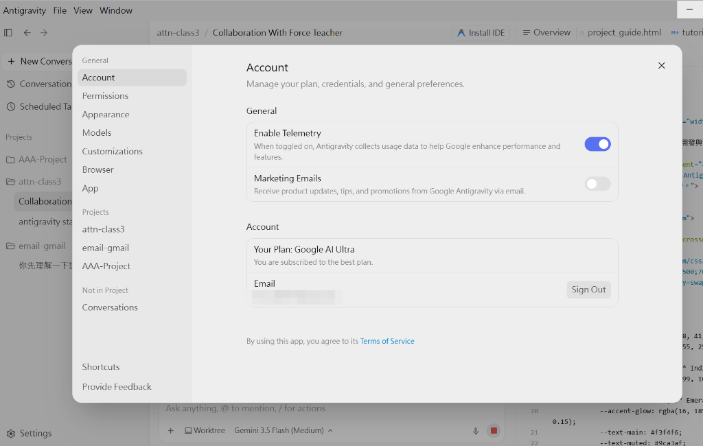

#### A. General (一般偏好)
* **`Enable Telemetry` (啟用遙測)**：啟用後，Antigravity 會收集匿名使用數據協助 Google 團隊分析效能與改善功能（建議保持開啟）。
* **`Marketing Emails` (行銷郵件)**：啟用後會透過電子郵件接收最新的產品功能更新、提示與推廣郵件。

#### B. Account (帳號與方案)
* **`Your Plan`**：顯示您當前的訂閱方案層級。畫面上顯示為 `Google AI Ultra`（目前最頂級訂閱方案）。
* **`Email`**：綁定的使用者 Google 帳號電子郵件。
* **`Sign Out` (登出)**：點擊後登出目前帳號，並清除本地登入資料。

### 4.4 權限配置 (Permissions) 面板詳解
點選左側 `General` -> `Permissions` 即可管理全域安全存取權限。這是 Antigravity 的安全防衛線，用來決定 AI 助理在開發時能接觸到您電腦系統的哪些資源：

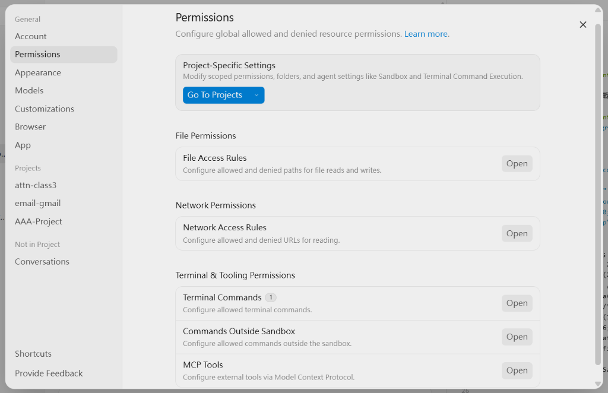

#### A. Project-Specific Settings (專案專屬安全設定)
* **核心作用**：雖然有全域權限限制，但不同專案的安全等級可能不同。
* **Go To Projects (下拉選單)**：點選後可選擇特定專案（例如 `attn-class3`），對其進行個別的安全覆蓋設定。例如：是否讓該專案在獨立的沙盒（Sandbox）中執行、是否開啟終端機命令的自動執行等。

#### B. File Permissions (檔案權限管理)
* **核心作用**：防範 AI 誤讀或誤寫您電腦中的機密目錄。
* **File Access Rules (Open 按鈕)**：點擊可進入子頁面，配置「路徑白名單」與「路徑黑名單」。預設情況下 AI 僅有權存取掛載專案內的檔案，若有需要讀寫外部特定資料夾，需在此處配置放行。

#### C. Network Permissions (網路權限管理)
* **核心作用**：限制 AI 上網抓取資料的連線範圍。
* **Network Access Rules (Open 按鈕)**：設定允許或禁止 AI 讀取與存取的特定網路網址 (URLs) 或網域 (Domains)。在進行 API 整合或第三方資源拉取時，可在此處提供白名單授權。

#### D. Terminal & Tooling Permissions (終端指令與外部工具權限)
* **Terminal Commands (Open 按鈕)**：
  * **作用**：當 AI 提出要在您系統執行終端指令（例如 `npm run dev`、`git commit` 等）時，必須先經過安全授權。
  * **標記數字 (如 1)**：代表目前已有 `1` 個已配置（允許或拒絕）的指令規則。點擊 Open 可查閱或移除該規則。
* **Commands Outside Sandbox (Open 按鈕)**：
  * **作用**：預設的程式指令會在安全的「隔離沙盒 (Sandbox)」中執行以保護作業系統。若有些特殊指令需要直接操作您真實的主機環境，必須在此特別將該指令放行。
* **MCP Tools (Open 按鈕)**：
  * **作用**：設定 Model Context Protocol (MCP) 連線。這是現代 AI 開發的開放標準協定，可透過對接外部 MCP 伺服器來擴充 AI 的工具庫（例如讓 AI 獲得操作 SQL 資料庫或串接特定 API 的能力）。

---

## 5. 外觀與對話顯示設定 (Appearance & Chat Display Settings)

本節說明如何自訂對話顯示偏好，以及客製化亮色/暗色主題的視覺介面。

### 5.1 如何切換至外觀設定
點擊主介面左下角的 **`Settings` (齒輪圖標)**，在開啟的對話框左側選擇 **`Appearance`**。

### 5.2 核心功能詳解
點擊 `General` -> `Appearance` 即可查閱右側面板：

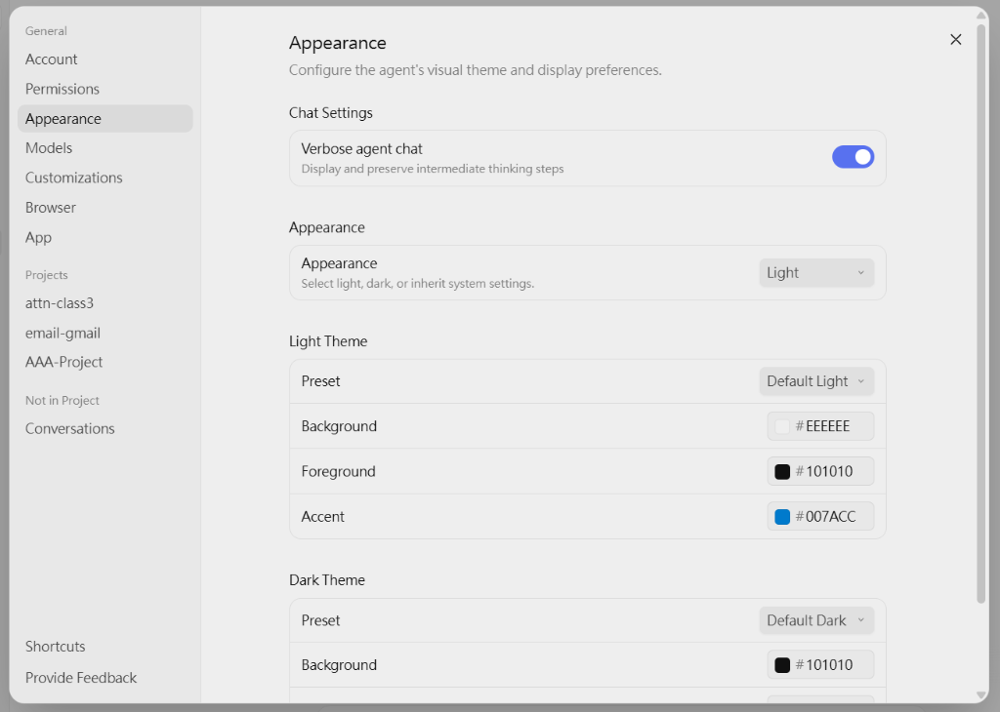

1. **Chat Settings (對話設定)**：
   * **`Verbose agent chat` (詳細對話模式)**：啟用後（預設開啟），對話中會顯示並保留 AI 助理在輸出最終答案前的**中間思考步驟（Thinking Steps）**。這在開發或 Debug 時，能讓學生了解 AI 的推理過程，非常具有學習與排錯價值。
2. **Appearance (主題外觀)**：
   * **`Appearance` (外觀模式)**：下拉選單提供 `Light` (亮色模式)、`Dark` (暗色模式) 以及 `System` (跟隨系統設定)。
3. **Light Theme & Dark Theme (亮/暗色主題細部客製化)**：
   * **Preset (預設值)**：可選擇預設配色（如 `Default Light`, `Default Dark` 等）。
   * **顏色調色盤 (Background, Foreground, Accent)**：提供色彩選取器，允許使用者針對背景色 (Background)、前景色/文字色 (Foreground) 以及強調色 (Accent) 進行細部微調，打造專屬的高質感程式開發面板。

---

## 6. AI 模型與配額管理 (AI Models & Quotas)

本節說明如何檢視目前的 AI 模型可用額度、時限，以及控制點數超額時的運行機制。

### 6.1 如何切換至模型設定
點擊主介面左下角的 **`Settings` (齒輪圖標)**，在開啟的對話框左側選擇 **`Models`**。

### 6.2 核心功能詳解
點擊 `General` -> `Models` 即可查閱右側面板：

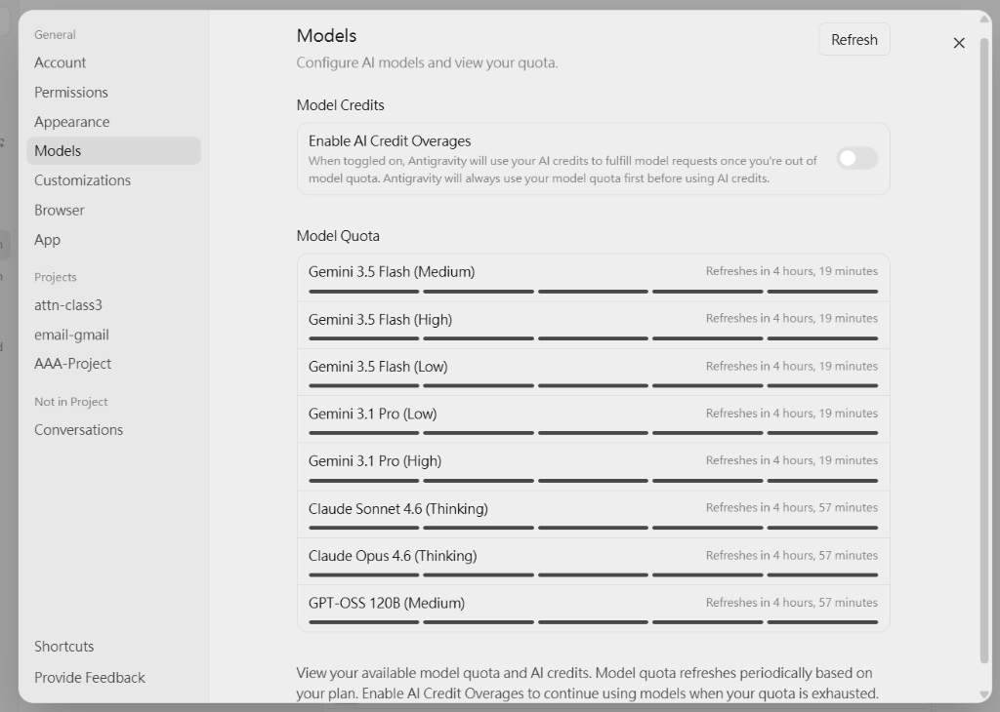

1. **Model Credits (模型點數/額度)**：
   * **`Enable AI Credit Overages` (啟用信用點數超額)**：預設為關閉。若開啟，當您的基本模型配額耗盡時，系統將自動扣除您的 AI 儲值點數（Credits）來填補請求，讓開發不中斷。系統始終會先消耗免費的 Model Quota，耗盡後才會動用 Credits。
2. **Model Quota (模型配額列表)**：
   * **多模型支援**：Antigravity 同時支援多種業界頂尖模型，包含：
     * **Gemini 系列**：Gemini 3.5 Flash 系列（分 High/Medium/Low 三種配額頻率）與 Gemini 3.1 Pro 系列。
     * **Claude 系列**：Claude Sonnet 4.6 (Thinking) 與 Claude Opus 4.6 (Thinking)。
     * **GPT-OSS 系列**：開源社群模型 GPT-OSS 120B。
   * **限額與倒數指示**：每一種模型下方都有一個視覺化進度條代表剩餘配額。右側會顯示配額重設的倒數時間（例如 `Refreshes in 4 hours, 19 minutes`），方便學生在配額有限時合理分配，或切換至其他模型繼續實作。

---

## 7. 自訂指令與技能管理 (Customizations & Skills)

本節說明如何檢視 Antigravity 的自訂行為配額，以及目前系統所載入的 39 個核心外掛技能（Skills）。

### 7.1 如何切換至自訂設定
點擊主介面左下角的 **`Settings` (齒輪圖標)**，在開啟的對話框左側選擇 **`Customizations`**。

### 7.2 核心功能與 Token 配額

在沒有載入任何額外插件或自訂規則的**一般正常狀態**下，點擊 `General` -> `Customizations` 查閱的右側面板如下所示：

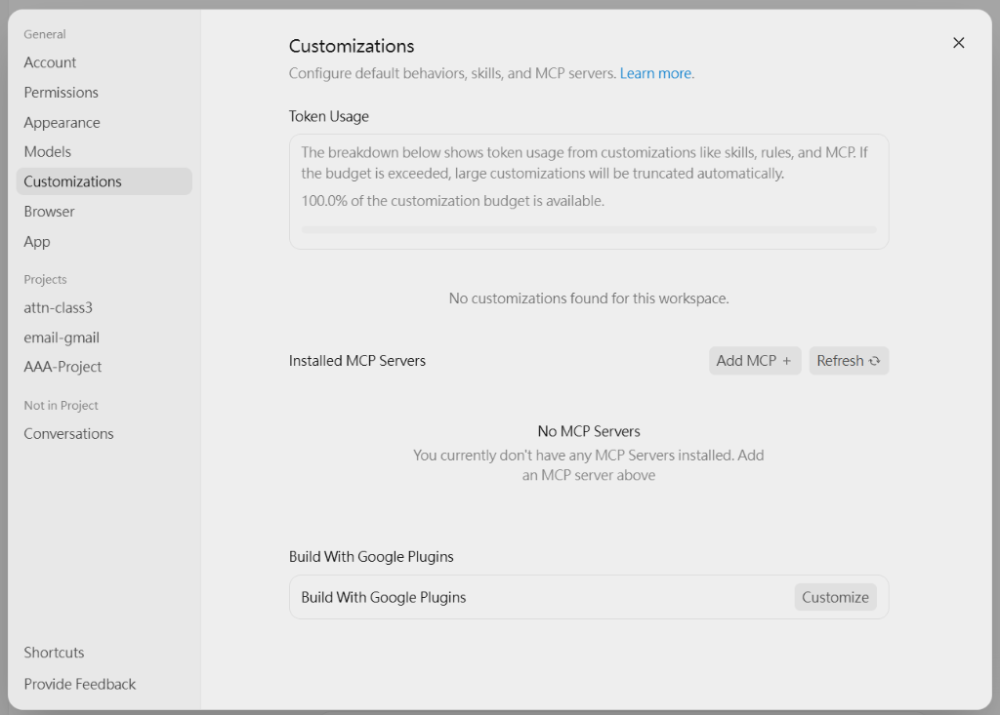

1. **Token Usage (自訂資源配額比率)**：
   * 顯示目前載入的技能、規則與 MCP 伺服器所佔用的記憶體/Token 配額。在乾淨狀態下會顯示為 `100.0% of the customization budget is available.` (配額完全可用)。如果裝載了太多技能導致超過上限，過大的自訂配置將會被系統自動截斷。
2. **Installed MCP Servers (外部 MCP 伺服器安裝)**：
   * 顯示目前安裝的 Model Context Protocol 伺服器列表。在乾淨狀態下會顯示為 `No MCP Servers`，可在此點擊 `Add MCP +` 來擴充新工具。
3. **Build With Google Plugins (Google 外掛套件自訂)**：
   * 可點擊 `Customize` 進入子頁面自訂、下載或刪除 Google 原生開發的套件模組（如 Android、Science、Firebase 等）。

---

### 7.3 外掛技能的擴充與管理機制 (新增、刪除與停用)

> [!IMPORTANT]
> **在目前的 Antigravity 版本中，使用者自訂外掛技能 (Skills) 的新增與刪除在介面上是沒有獨立按鈕的。目前暫時需要依靠「與 AI 進行對話互動（請 AI 自動提煉工作流）」來產生，或是「在電腦的檔案總管中手動建立與刪除資料夾檔案」來完成管理。**

外掛技能 (Skills) 不是一成不變的，使用者可以依據專案需求自行新增自訂技能，或者停用/刪除不需要的技能。

#### A. 如何「新增」自訂外掛技能？
系統提供兩種方式來擴充技能：
1. **自動提煉 (工作流生成)**：
   當您在對話中與 AI 助理完成了某個複雜的開發流程或 API 串接後，可以直接下指令如：
   > *「請將我們剛才完成的這個開發流程，打包提煉成一個新的 Skill。」*
   
   系統會自動叫用 `workflow_skill_creator` 技能，透過多輪問答確認輸入、輸出與錯誤處理邏輯後，自動在對應資料夾內為您產生 `SKILL.md` 與輔助執行腳本。
2. **手動建立**：
   技能的本質即為一個包含 `SKILL.md` 的資料夾。您可以直接建立該資料夾並撰寫 `SKILL.md` (包含必要的 YAML 標頭如 `name` 與 `description`)：
   * **專案專屬 (Local)**：放置於專案根目錄的 `.agents/skills/自訂技能名稱/`。
   * **全域通用 (Global)**：放置於系統全域目錄 `C:\Users\user\.gemini\config\skills/自訂技能名稱/`。

#### B. 如何「刪除」或「停用」外掛技能？
1. **刪除與停用預設的 Plugins (如 Science 插件下的 38 個 Skills)**：
   這些預設技能是與 Google 內建插件綁定的。您可以點擊 `General` -> `Customizations` 中的 **Build With Google Plugins** 進入插件管理頁面。在該頁面中，您會看到所有安裝的插件套件（如 Android、Science、Firebase、Chrome DevTools 等），且右側皆有 **`Delete` (刪除)** 按鈕，可以點擊直接將整包插件（以及它所包含的所有預設 Skills）從系統中實體刪除。
   
   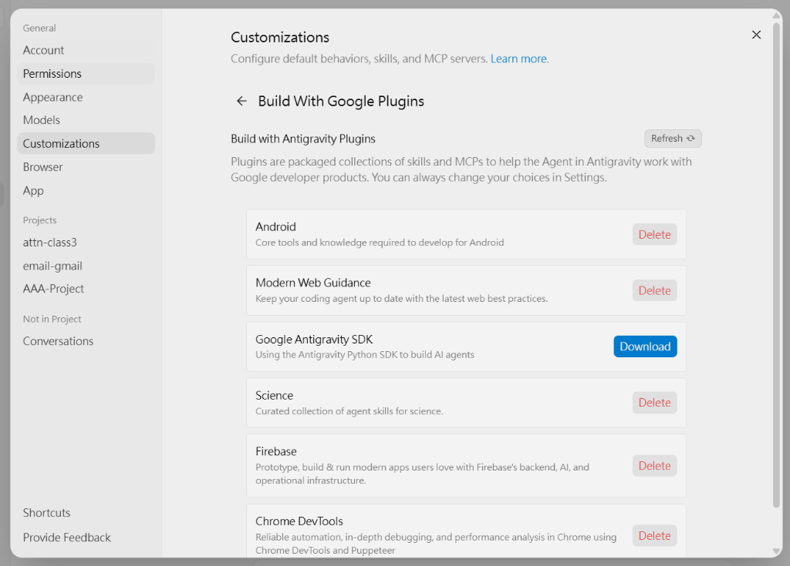
2. **刪除自訂的 Skills**：
   不論是 Local 還是 Global 的自訂 Skill，您只需要直接到對應的資料夾下**將該 Skill 的資料夾刪除或移出該目錄**，重新啟動對話或重載系統後，該 Skill 就不會再出現在列表中。

---

### 7.4 系統預載 39 個核心外掛技能 (Skills) 詳解

> [!NOTE]
> **備註**：系統在某些軟體版本安裝後，會預設啟用與下載這 39 個核心外掛技能（例如內建的 `science` 與 `android-cli-plugin` 等插件所屬的 Skills）。若您的專案並不需要這些學術或行動開發相關工具，可依據 **7.3 節** 的說明，在 `General` -> `Customizations` -> `Build With Google Plugins` 插件管理面板中點選 **`Delete`** 將整包插件卸載，以最大化釋放您的 Token 額度並清空客製化預算。

<details>
<summary><b>📦 點擊展開 / 收起 39 個預載核心外掛技能 (Skills) 詳細列表</b></summary>

#### 1. alphafold-database-fetch-and-analyze
* **Plugin**: science | **分類**: Global
* **說明**: 蛋白質結構預測分析。透過 UniProt Accession ID 抓取並分析蛋白質 3D 結構，評估結構信賴度 (pLDDT) 及無序區段。
* **適用時機**: 當使用者提供特定的 UniProt ID 且需要結構信賴度度量、結構域邊界分析時使用。若只有蛋白質、基因名稱或氨基酸序列，請先詢問 UniProt ID。

#### 2. alphagenome-single-variant-analysis
* **Plugin**: science | **分類**: Global
* **說明**: 基因變異效應預測。利用 AlphaGenome API 分析非編碼基因變異對基因表現量 (RNA-seq)、染色質開放性 (DNASE) 以及轉錄因子結合的影響。
* **適用時機**: 使用者查詢非編碼區段變異的致病性、臨床顯著性、剪接位點破壞或啟動子調控效應時。

#### 3. android-cli
* **Plugin**: android-cli-plugin | **分類**: Global
* **說明**: Android 命令列開發工具。使用 `android` CLI 執行專案建立、模擬器部署、SDK 管理及環境診斷。
* **適用時機**: 使用者需要進行 Android 行動應用程式開發、編譯或環境測試時。

#### 4. chembl-database
* **Plugin**: science | **分類**: Global
* **說明**: ChEMBL 藥物活性與化學結構資料庫。查詢活性小分子、藥物靶點、IC50/Ki 活性值及藥物作用機制。
* **適用時機**: 查詢特定化合物或小分子藥物的靶向活性及化學結構特徵時。

#### 5. clinical-trials-database
* **Plugin**: science | **分類**: Global
* **說明**: 美國臨床試驗資料庫檢索。透過 API 檢索 ClinicalTrials.gov 的試驗狀態、招募條件、NCT 編號詳情及贊助商。
* **適用時機**: 當需要搜尋特定疾病的臨床試驗、招募狀態或患者資格條件匹配時。

#### 6. clinvar-database
* **Plugin**: science | **分類**: Global
* **說明**: ClinVar 基因變異致病性資料庫。提供人類基因體變異的臨床顯著性與致病性分類 (如 Pathogenic、Benign、VUS)。
* **適用時機**: 需要尋找特定突變在醫學上的致病證據或基準對照組時。

#### 7. dbsnp-database
* **Plugin**: science | **分類**: Global
* **說明**: dbSNP 短基因變異資料庫。將 rsID、基因體 VCF 座標或 HGVS 格式字串相互轉換，回傳變異位置、人群頻率及關聯基因。
* **適用時機**: 當需要查詢特定 SNP 位點的染色體位置、等位基因頻率或疾病相關性時。

#### 8. embl-ebi-ols
* **Plugin**: science | **分類**: Global
* **說明**: EMBL-EBI 生物本體論查詢服務。提供 250 多個生醫學本體論（如 GO, DOID, HP）的術語階層與定義查詢。
* **適用時機**: 當需要解析生醫專有名詞、定位本體論節點或其父子關係時。

#### 9. encode-ccres-database
* **Plugin**: science | **分類**: Global
* **說明**: ENCODE 順式調控元件資料庫。查詢人類細胞中的調控元件（cCREs，如啟動子、增強子）及 ENCODE Portal 下的原始表觀遺傳學檔案。
* **適用時機**: 需要分析特定細胞株中的轉錄調控區域或表觀基因體學峰值 (Peaks) 時。

#### 10. ensembl-database
* **Plugin**: science | **分類**: Global
* **說明**: Ensembl 基因體與變異預測資料庫。作為主 ID 轉換器，查詢基因/轉錄本/蛋白質序列，並取得變異後果預測 (VEP)。
* **適用時機**: 需要轉換 ID、下載外顯子結構或查詢特定突變對蛋白質結構的預測影響時。

#### 11. foldseek-structural-search
* **Plugin**: science | **分類**: Global
* **說明**: Foldseek 蛋白質 3D 結構相似度比對。使用 PDB/CIF 三維座標檔案在 AlphaFold DB 或 PDB 中搜尋結構相似的蛋白質。
* **適用時機**: 使用者提供實體 3D 結構檔，並希望尋找演化上結構保守的同源蛋白質。

#### 12. gnomad-database
* **Plugin**: science | **分類**: Global
* **說明**: gnomAD 人群基因組變異資料庫。提供全基因體/外顯子體的變異人群頻率、基因耐受度指標（pLI, LOEUF）。
* **適用時機**: 評估突變是否為罕見變異，或評估該基因是否對功能喪失變異敏感。

#### 13. gtex-database
* **Plugin**: science | **分類**: Global
* **說明**: GTEx 人類組織基因表現量資料庫。提供 54 個非疾病人體組織中的 RNA 表現數據及變異表現量關聯 (eQTL)。
* **適用時機**: 查詢特定基因在正常人體組織中的表現特異性，或研究變異對特定組織表現量的影響。

#### 14. human-protein-atlas-database
* **Plugin**: science | **分類**: Global
* **說明**: 人類蛋白質圖譜。提供半定量蛋白質表現數據，以及蛋白質在細胞內的定位與免疫組織化學染色結果。
* **適用時機**: 當需要確認蛋白質在人體不同組織中的空間定位與真實表現情形時。

#### 15. interpro-database
* **Plugin**: science | **分類**: Global
* **說明**: InterPro 蛋白質家族與結構域資料庫。識別蛋白質序列中的結構域 (Domain)、功能特徵位點及進行 GO 註解。
* **適用時機**: 分析未知功能蛋白質序列的保守結構域或分類。

#### 16. jaspar-database
* **Plugin**: science | **分類**: Global
* **說明**: JASPAR 轉錄因子結合矩陣資料庫。查詢轉錄因子的位置頻率矩陣 (PFM) 或位置權重矩陣 (PWM) 以及元數據。
* **適用時機**: 當需要預測特定轉錄因子的 DNA 結合特徵或轉換矩陣格式時。

#### 17. literature-search-arxiv
* **Plugin**: science | **分類**: Global
* **說明**: arXiv 學術文獻檢索。搜尋 arXiv 預印本論文，擷取文獻元數據、摘要並下載 PDF。
* **適用時機**: 查詢最新的電腦科學、數學、計算生物學預印本論文。

#### 18. literature-search-biorxiv
* **Plugin**: science | **分類**: Global
* **說明**: bioRxiv/medRxiv 生物醫學預印本檢索。瀏覽、篩選並下載生物及醫學界的預印本文獻。
* **適用時機**: 需要快速取得最新（尚未經同儕審查）的生物醫學研究發現。

#### 19. literature-search-europepmc
* **Plugin**: science | **分類**: Global
* **說明**: Europe PMC 生物醫學文獻檢索。提供數百萬篇生醫論文、全文摘要、引用連結檢索及 PDF 下載。
* **適用時機**: 當需要廣泛檢索醫學與生命科學文獻並提取全文時。

#### 20. literature-search-openalex
* **Plugin**: science | **分類**: Global
* **說明**: OpenAlex 全球學術圖譜。可透過 DOI 查詢文獻，計算作者引用指標、h-index、期刊影響因子及學術機構產出。
* **適用時機**: 分析文獻引用關係、學術網絡或進行大範圍文獻統計計量時。

#### 21. ncbi-sequence-fetch
* **Plugin**: science | **分類**: Global
* **說明**: NCBI 生物序列下載。使用 E-utilities 下載 DNA、RNA、質體或蛋白質的 FASTA 序列。
* **適用時機**: 需要利用 NCBI 登入號 (Accession Number) 快速獲取基因或蛋白質序列時。

#### 22. openfda-database
* **Plugin**: science | **分類**: Global
* **說明**: 美國 openFDA 食品藥物監管數據庫。查詢藥物與醫材的上市後不良反應、說明標籤、短缺及核准紀錄。
* **適用時機**: 調查藥物安全性、藥品仿單（Labeling）或醫療器材警戒時。

#### 23. opentargets-database
* **Plugin**: science | **分類**: Global
* **說明**: Open Targets 藥物靶點發現平台。提供基因-疾病關聯強度、靶點成藥性 (Tractability) 及已知臨床藥物。
* **適用時機**: 當在評估某基因是否適合作為新藥開發的靶點，或查詢其安全評估時。

#### 24. pdb-database
* **Plugin**: science | **分類**: Global
* **說明**: PDB 大分子實驗結構資料庫。檢索並下載實驗测定的生物大分子（蛋白質、核酸）3D 結構，支持序列或結構相似性搜索。
* **適用時機**: 需要獲取已發表的蛋白質實驗晶體結構模型（PDB 檔案）時。

#### 25. protein-sequence-msa
* **Plugin**: science | **分類**: Global
* **說明**: Clustal Omega 多重序列比對。針對多條蛋白質序列進行對齊，用以評估氨基酸保守性或辨識演化關係。
* **適用時機**: 需要比對多個同源基因或蛋白質序列的異同。

#### 26. protein-sequence-similarity-search
* **Plugin**: science | **分類**: Global
* **說明**: MMseqs2/BLAST 序列同源搜尋。依據給定的蛋白質序列，在各大公共資料庫中尋找同源或序列相似的蛋白質。
* **適用時機**: 拿到一條未知序列，需要透過同源性比對來推測其蛋白質功能時。

#### 27. pubchem-database
* **Plugin**: science | **分類**: Global
* **說明**: PubChem 化學分子與藥物資料庫。透過名稱、CID 或 SMILES 搜尋化學物質、查詢物理性質及生物活性。
* **適用時機**: 需要查詢化學小分子的分子量、拓撲極性表面積（TPSA）、毒性或同源小分子結構時。

#### 28. pubmed-database
* **Plugin**: science | **分類**: Global
* **說明**: PubMed 文獻與分子關聯資料庫。檢索 MEDLINE 數據，並將文獻關聯到基因、蛋白質及 PubChem 小分子上。
* **適用時機**: 精準檢索特定突變或藥物在學術論文中的研究紀錄。

#### 29. pymol
* **Plugin**: science | **分類**: Global
* **說明**: PyMOL 3D 結構渲染與分析。控制 PyMOL 軟體對蛋白質結構進行 3D 著色、標記結合位、測量原子距離與疊合結構。
* **適用時機**: 當使用者需要展示蛋白質結合腔的立體結構、高畫質渲染出圖或比對兩個蛋白質結構時。

#### 30. quickgo-database
* **Plugin**: science | **分類**: Global
* **說明**: QuickGO 基因功能本體論檢索。查詢特定基因的生物學過程、細胞定位及分子功能註解 (Gene Ontology)。
* **適用時機**: 需要確認特定蛋白質在細胞內發揮何種功能、參與什麼生理途徑時。

#### 31. reactome-database
* **Plugin**: science | **分類**: Global
* **說明**: Reactome 生物學通路資料庫。查詢代謝與反應通路、進行基因集富集分析 (Enrichment) 及通路階層檢索。
* **適用時機**: 需要研究某一組差異表現基因主要富集在哪些人體代謝通路時。

#### 32. science-skills-common
* **Plugin**: science | **分類**: Global
* **說明**: 生醫科學工具共用底層套件。包含統一的連線重試、限速與 API 連線模組，供其他 Science 工具底層叫用。
* **適用時機**: 此為後台共用模組，使用者與 AI 不直接單獨調用。

#### 33. scienceskillscommon
* **Plugin**: science | **分類**: Global
* **說明**: 生醫科學工具共用底層複本。輔助提供限速連線模組，維持底層套件穩定度。
* **適用時機**: 後台共用模組，使用者與 AI 不直接單獨調用。

#### 34. string-database
* **Plugin**: science | **分類**: Global
* **說明**: STRING 蛋白質交互作用資料庫。查詢蛋白質之間的已知物理接觸與功能性網路，包含交互證據與信賴評分。
* **適用時機**: 需要建構蛋白質交互作用網絡圖 (PPI Network) 或尋找其上下游關聯蛋白時。

#### 35. ucsc-conservation-and-tfbs
* **Plugin**: science | **分類**: Global
* **說明**: UCSC 基因體保守性與轉錄因子結合區。從 UCSC 獲取演化保守性評分 (phyloP/phastCons) 及轉錄因子結合區間 (TFBS)。
* **適用時機**: 分析某基因突變位點是否位於演化上極度保守的重要調控區域。

#### 36. unibind-database
* **Plugin**: science | **分類**: Global
* **說明**: UniBind 轉錄因子結合位點實驗資料庫。下載經過實驗 (ChIP-seq) 驗證的真實轉錄因子-DNA 結合位點坐標。
* **適用時機**: 下載特定的 TF 結合位置 BED 檔案，以進行本地生物資訊學分析。

#### 37. uniprot-database
* **Plugin**: science | **分類**: Global
* **說明**: UniProt 蛋白質知識庫。生醫領域最具代表性的蛋白質數據庫，查詢功能描述、分類特徵、活性位點與序列變異。
* **適用時機**: 查詢蛋白質功能、結構特徵或變異後後果的基本背景資訊。

#### 38. uv
* **Plugin**: science | **分類**: Global
* **說明**: uv Python 套件快速安裝管理器。檢查並在環境中配置高效能 Python 套件管理器 uv，加速科學運算套件的部署。
* **適用時機**: 當系統執行其他需要安裝相依 Python 套件的工具前作為預備步驟。

#### 39. workflow-skill-creator
* **Plugin**: science | **分類**: Global
* **說明**: 工作流技能提煉生成器。將使用者完成的複雜多步驟工作流或交互歷程，精簡編寫成一個 AI 可以重用的自訂技能 (Skill)。
* **適用時機**: 當使用者指示「將我們剛剛完成的步驟打包成一個 Skill」時使用。
</details>


---

## 8. 瀏覽器自動化設定 (Browser Settings)

本節說明如何設定瀏覽器代理程式（Browser Subagent），此功能允許 AI 在對話框輸入 `/browser` 來執行網頁瀏覽、資訊檢索或網頁自動化測試。

### 8.1 如何切換至瀏覽器設定
點擊主介面左下角的 **`Settings` (齒輪圖標)**，在開啟的對話框左側選擇 **`Browser`**。
*(註：此功能需要您的電腦上安裝有 Google Chrome 瀏覽器)*。

### 8.2 核心功能與權限
點擊 `General` -> `Browser` 即可查閱右側面板：

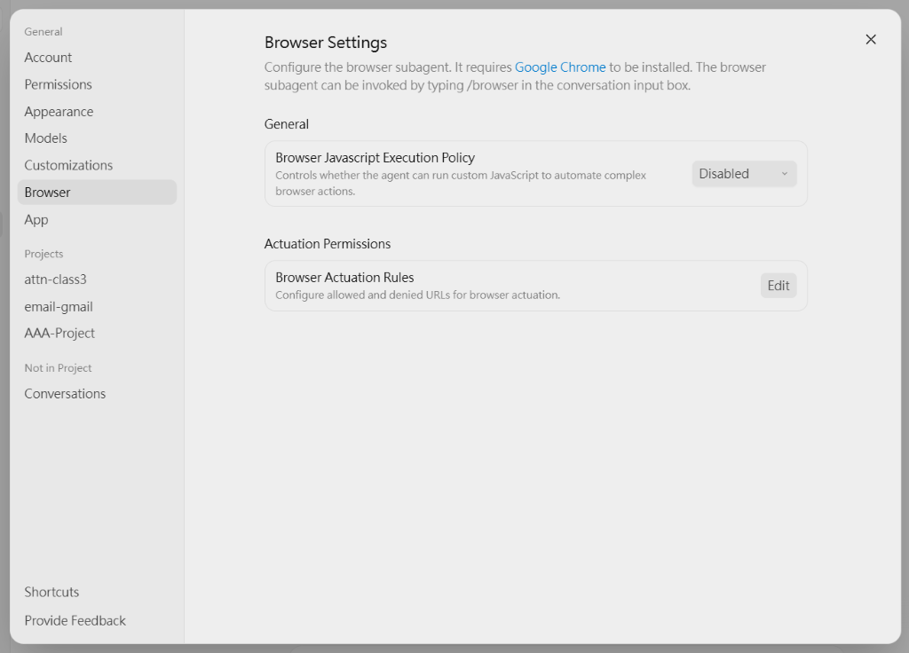

1. **General (一般設定)**：
   * **`Browser Javascript Execution Policy` (瀏覽器 JS 執行原則)**：目前選取 `Disabled` (已停用)。此下拉選單用以決定是否允許 AI 執行自訂的 JavaScript 腳本，來自動化複雜的網頁操作（如模擬點擊、表單填寫）。為確保系統安全，預設通常建議停用，在可信任的開發環境下才開啟。
2. **Actuation Permissions (自動化執行權限)**：
   * **`Browser Actuation Rules` (瀏覽器操作規則)**：點選 `Edit` 可以進入黑白名單子頁面，配置允許或禁止 AI 進行自動化瀏覽控制的網址 (URLs)。這能防止 AI 助理自動點擊不安全或未授權的外部網頁連結。

---

## 9. 應用程式基礎設定 (App Settings)

本節說明如何管理 Antigravity 應用程式在您作業系統上的執行模式及通知。

### 9.1 如何切換至應用程式設定
點擊主介面左下角的 **`Settings` (齒輪圖標)**，在開啟的對話框左側選擇 **`App`**。

### 9.2 核心功能與系統整合
點擊 `General` -> `App` 即可查閱右側面板：

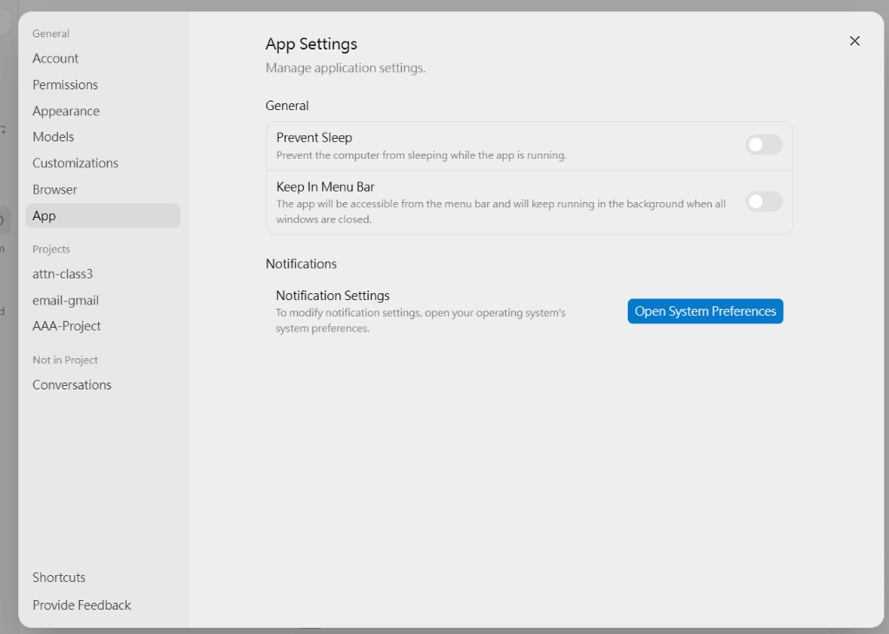

1. **General (一般設定)**：
   * **`Prevent Sleep` (防止電腦休眠)**：預設為關閉。若開啟，當 Antigravity 正在進行耗時較長的工作流、建置、下載或執行背景排程任務時，系統將阻止您的電腦進入睡眠模式，以防工作中斷。
   * **`Keep In Menu Bar` (在選單列保持啟動)**：預設為關閉。若開啟，當您關閉主軟體視窗後，軟體仍會在工作列背景保持運行，隨時可以從系統選單列快速將其喚醒，減少重複載入的時間。
2. **Notifications (通知設定)**：
   * **`Notification Settings`**：當有背景任務執行完成或計時器觸發時，AI 會發送系統通知。點擊 `Open System Preferences` 按鈕會直接開啟您 Windows 作業系統的通知設定面板，供您微調通知橫幅、聲音及權限。

---

## 10. 實戰演練 - 建立與管理第一個自訂 Skill

本章帶領學生在專案中實際建立一個自訂 Skill，並說明如何驗證其載入效果，以及解釋為何在軟體設定介面中找不到「刪除自訂 Skill」的按鈕。

### 10.1 建立步驟與偵測
1. **建立資料夾**：
   在您的專案根目錄下，進入（或新建）`.agents/skills/` 資料夾，並在其中建立一個與 Skill 同名的新資料夾，例如 `hello-world-helper`。
2. **撰寫 SKILL.md**：
   在 `hello-world-helper` 底下建立一個 `SKILL.md` 檔案，定義其 YAML 標頭（包含 `name` 與 `description`）與功能描述。
3. **查看載入效果**：
   點擊主介面左下角 **Settings (齒輪)**，在左側 `Projects` 清單中點選您的專案（例如 `attn-class3`）。往下滑動至 Skills 列表，您會看到系統已經動態且自動地將我們建立的 `hello-world-helper` 載入！

### 10.2 為什麼在 Skills 列表中找不到「刪除自訂 Skill」的按鈕？
如下圖所示：

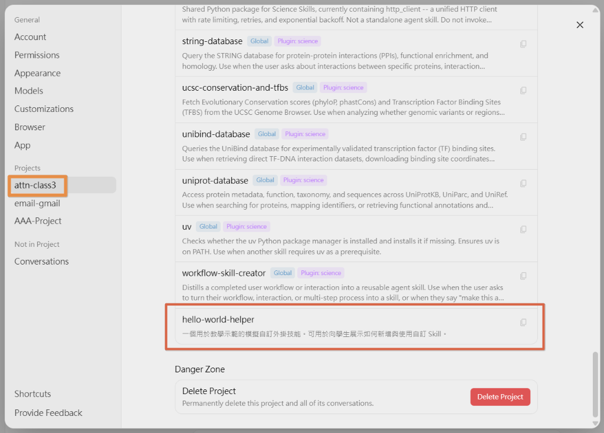

1. **僅提供 Copy (複製) 功能**：
   在專案的技能列表中，`hello-world-helper` 旁僅有一個「Copy (複製)」圖示，**沒有任何 Delete (刪除) 鍵**。這是因為 Antigravity 採用了「實體目錄掃描」機制。
2. **安全保護設計**：
   為了防止使用者在軟體操作時，不小心誤刪專案硬碟中的實體代碼或 Skill 引導規則檔案，軟體 UI 不會提供實體檔案的刪除功能。
3. **如何移除自訂 Skill**：
   若想從列表中移除自訂 Skill，您必須回到您的作業系統中（如 Windows 檔案總管或編輯器），直接前往專案路徑（例如 `d:\AAA-Project\attn-class3\.agents\skills\`），**將 `hello-world-helper` 資料夾刪除**。刪除後重載軟體或刷新設定頁面，該項目即會自動在列表中消失。

---

## 11. 專案專屬偏好與本地安全權限設定 (Project-Specific Settings)

在 Antigravity 中，除了全域設定（General Settings）之外，您還可以針對各個載入的專案進行**專案專屬偏好與安全權限設定**。專案設定具有更高的優先權，能覆蓋全域安全設定，以滿足不同專案的客製化安全要求。

### 11.1 如何進入專案設定
點選設定視窗左側的 `Projects` 列表，點擊您要管理的專案名稱（例如 **`attn-class3`**），即可於右側開啟專案專屬設定面板。

---

### 11.2 專案偏好設定與運作行為 (Agent Settings & Behavior)
如下圖所示，面板上半部主要管理專案的資料夾範圍與 AI 代理的執行模式：

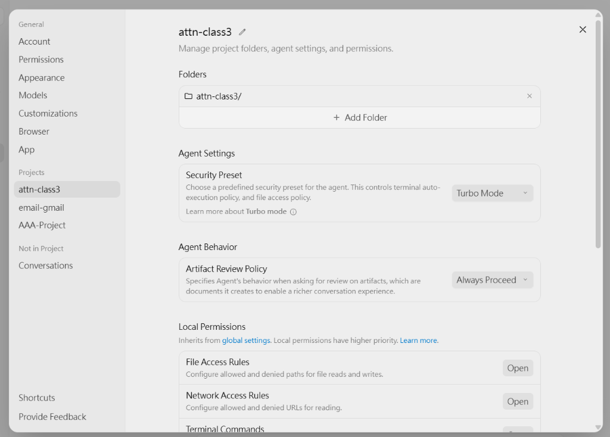

1. **Folders (專案載入目錄)**：
   * 顯示目前此專案所綁定的本地資料夾路徑（例如 `attn-class3/`）。您也可以在此點選 **`+ Add Folder`** 為此專案關聯多個本地資料夾，讓 AI 可以跨目錄讀取與協作。
2. **Agent Settings (代理執行安全設定)**：
   * **`Security Preset` (安全預設等級)**：共有三種預設方案與自訂選項，用以控制終端自動執行與檔案讀寫範圍：
     
     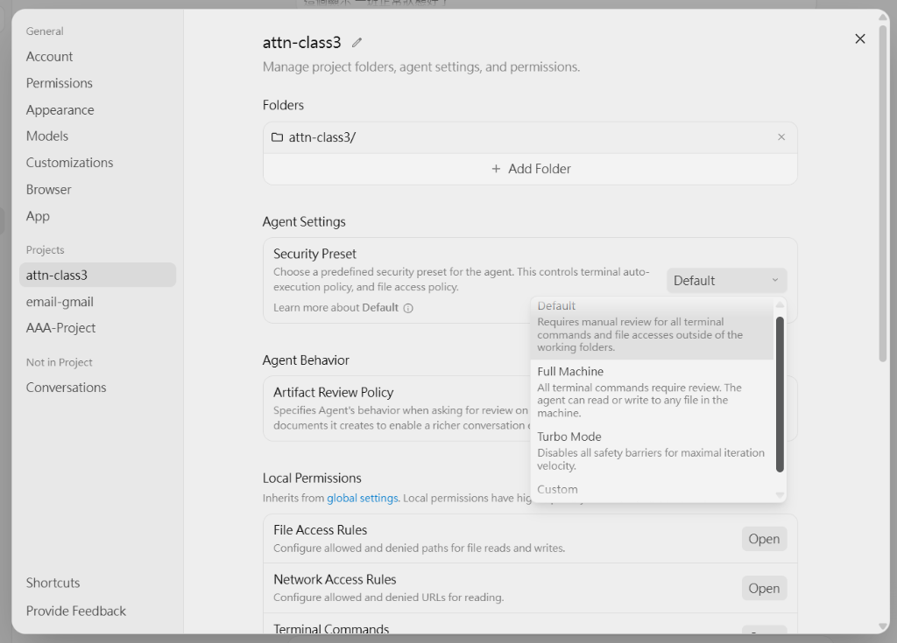
     
     * **`Default` (預設安全)**：執行任何終端機指令、以及存取「工作目錄以外」的檔案時，AI 都必須手動向使用者請求核准。
     * **`Full Machine` (全機存取)**：允許 AI 直接讀寫您電腦上的任何檔案，但執行終端機指令仍需手動審查核准。
     * **`Turbo Mode` (極速模式)**：關閉所有安全防線。指令自動執行、檔案自由存取，提供極速的開發迭代效率。
     * **`Custom` (自訂權限)**：若選取自訂，您可以單獨微調以下兩個細部安全原則：
       
       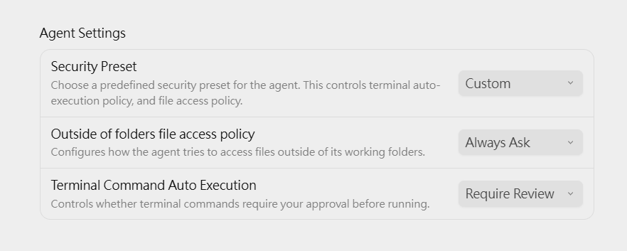
       
       * **`Outside of folders file access policy` (工作目錄外的檔案存取原則)**：可設定 `Always Ask` (每次詢問，預設)、`Allow` (允許)、`Deny` (拒絕)。
         
         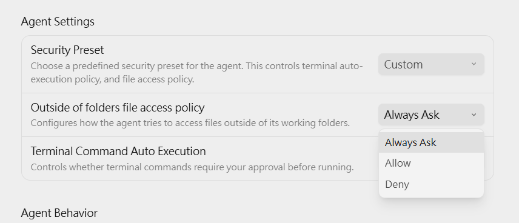
         
       * **`Terminal Command Auto Execution` (終端指令自動執行原則)**：可設定 `Require Review` (需要審查，預設) 或 `Always Proceed` (直接執行)。
         
         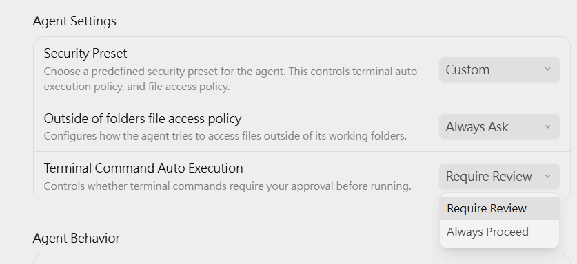

3. **Agent Behavior (代理行為策略)**：
   * **`Artifact Review Policy` (文件審查原則)**：控制 AI 助理在創建或更新輔助文件（Artifacts）時，是否必須先向使用者請求批准。
     
     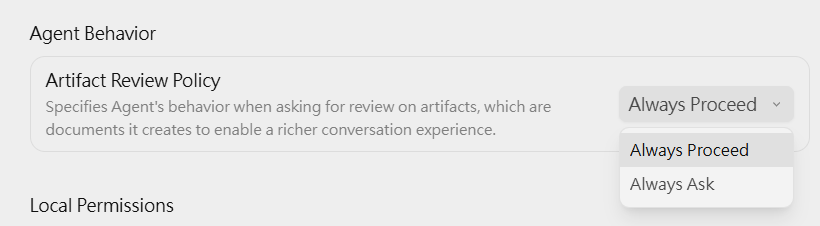
     
     * **`Always Proceed` (直接執行，預設)**：AI 直接在背景創建並更新這些輔助文件，不中斷對話，協作體驗最流暢。
     * **`Always Ask` (每次詢問)**：AI 每建立一個 Artifact，都會在對話中彈出按鈕請求使用者審查批准。

---

### 11.3 本地安全權限覆蓋與管理 (Local Permissions & Danger Zone)
如下圖所示，面板下半部管理專案的本地安全權限，並繼承自全域安全設定：

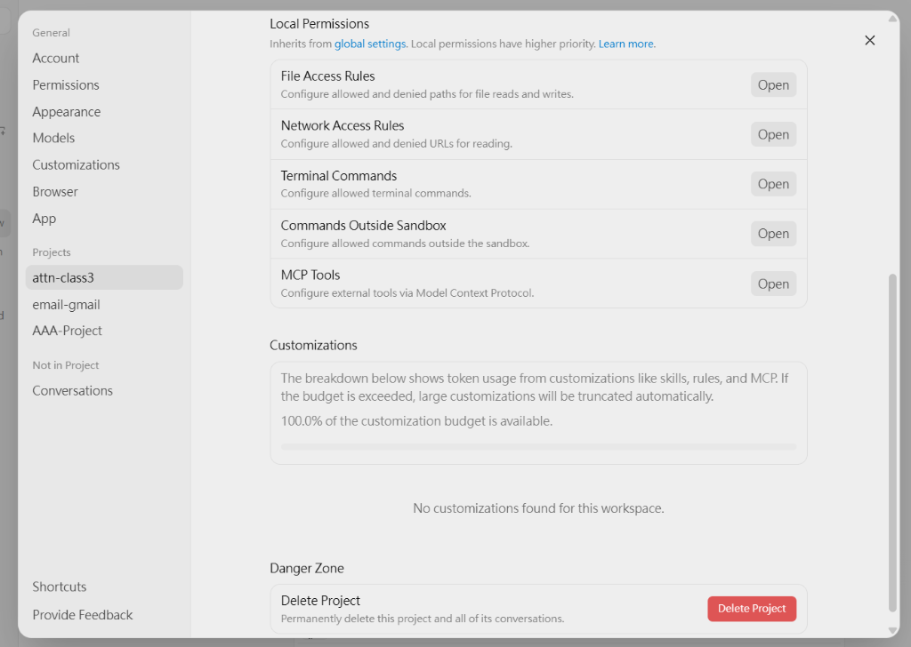

1. **Local Permissions (本地專案權限)**：
   * **核心原則**：本地專案權限**優先於全域設定 (Inherited from global settings. Local permissions have higher priority.)**。您可以在此針對本專案單獨放寬或收緊特定目錄的檔案讀寫（`File Access Rules`）、網路域名連線（`Network Access Rules`）、終端指令（`Terminal Commands`）、非沙盒環境指令（`Commands Outside Sandbox`）以及外部 `MCP Tools`。
2. **Customizations (專案自訂技能與 Token 配額)**：
   * 顯示本專案專屬載入的 Skills、自訂規則與 MCP 伺服器的 Token Usage 配額。此處顯示 `100.0%` 可用，因為該專案目前沒有載入任何自訂擴充。
3. **Danger Zone (危險區域)**：
   * **`Delete Project` (刪除專案)**：點擊此紅色按鈕，將會從 Antigravity 中**永久刪除此專案配置以及其所有的歷史對話紀錄**。該按鈕僅會移除軟體內的關聯與對話快取，不會刪除您硬碟上的專案實體代碼檔案。

---

## 12. 實戰進階 - 建立 GitHub Connector 技能

本章節引導學生為專案建立一個實用的 **GitHub Connector** 自訂技能，使 Antigravity AI 助理能透過 GitHub REST API 讀取或寫入 GitHub 儲存庫的資訊。

### 12.1 為什麼需要建立 GitHub Connector？
* **遠端程式庫對接**：允許 AI 助理自動從 GitHub 取得最新的程式庫架構、Issue 列表、Pull Requests 等，加速開發與除錯。
* **自動化協作**：使 AI 助理能直接在專案中建立 Issue、提交檔案變更，提升人機協作的開發效率。
* **安全性與權限限制**：透過本地 `.env` 管理憑證，避免金鑰外洩。

### 12.2 技能資料夾與檔案結構
在專案目錄 `.agents/skills/github-connector/` 下，共包含以下四個主要檔案：
* `SKILL.md`：自訂技能的引導文件，定義技能名稱、說明與 AI 使用的命令參數。
* `github_connector.py`：使用 Python 標準函式庫 `urllib` 與 `base64` 實作的 API 介接 CLI 腳本，具有零外部依賴、相容性佳的優點。
* `requirements.txt`：列出所需的套件。
* `.env.template`：環境變數範本，說明如何設定 `GITHUB_TOKEN`。

### 12.3 核心程式碼實現與 AI 調用
1. **設定金鑰**：
   將 `.env.template` 複製並重新命名為 `.env`，填入您的 GitHub Personal Access Token (PAT)。
   ```env
   GITHUB_TOKEN=ghp_yourActualTokenHere
   ```
2. **測試技能**：
   學生可在終端機中執行測試腳本，驗證與 GitHub 的連線：
   ```powershell
   python .agents/skills/github-connector/test_connector.py
   ```
   若成功，終端機將會顯示儲存庫 `octocat/hello-world` 的中繼資料與檔案列表。

3. **AI 助理自動調用**：
   因為我們在 `.agents/skills/github-connector/SKILL.md` 中詳細定義了參數，當學生詢問：*「幫我看看 GitHub 上的 octocat/hello-world 專案裡有什麼檔案？」*，Antigravity 會自動呼叫 `github_connector.py --action list_files --repo octocat/hello-world` 並為您呈現結果。

---

## 附錄：協作規範與原則

本專案採用人機協作模式，為確保 AI 能理解教學脈絡、學生能清晰掌握變更，請嚴格遵守以下角色與記錄規範：

### 角色定義
* **指導老師**：指導老師 / 導師，引導學生學習並下達核心指令。
* **Antigravity**：Antigravity 本 AI 助理，負責落實開發、生成說明文檔。
* **ChatGPT**：ChatGPT 協作夥伴，提供創意發想與邏輯諮詢。
* **Codex**：Codex 協作夥伴，專注於代碼最佳化與底層解析。

### 協作原則
1. **重要步驟全程紀錄**：開發與教學中的每個重要轉折、功能實現，皆須保留步驟說明與歷程記錄。
2. **雙版本輸出原則**：
   每個重要規劃，皆會同時生成：
   * **Markdown (.md)** 供 AI (Antigravity, ChatGPT, Codex) 閱讀理解與脈絡檢索。
   * **HTML (.html)** 供人類（師生）閱讀，具備良好視覺美感。
3. **終極專案目標**：本專案所有生成的步驟及說明，最終將統一整併進本 HTML 教學頁面，成為學生的實戰學習教材。

---
© 2026 Falo x Force Cheng | Release Date: 2026/6/8 | Version: Ver 1.01 | 教學用途，如有商業用途請聯繫作者
